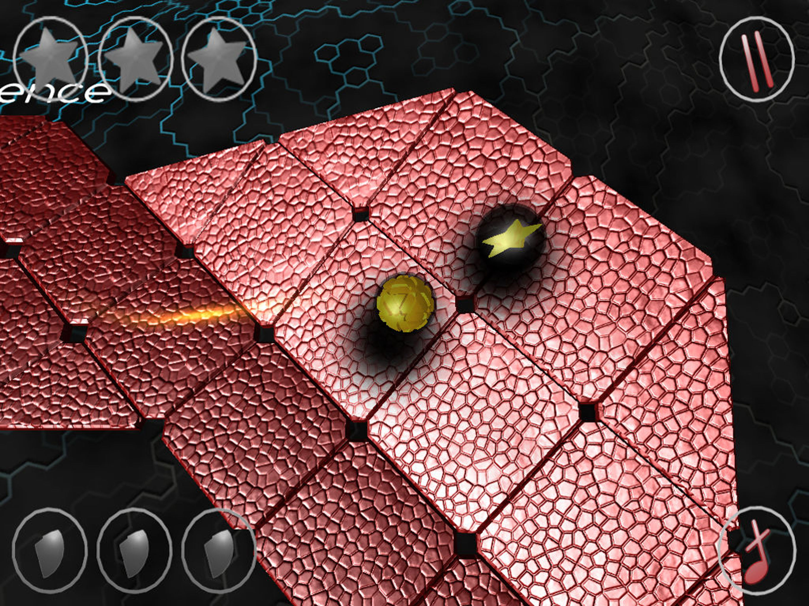

  

👋 Hi! I'm Matthias and I make things in iOS, Flutter and in Unity.

📱 Currently freelancing. Previously at Chrono24, Dr. Oetker, IBM iX.

📫 How to reach me: [@matthias_code](https://twitter.com/matthias_code), [YouTube](https://www.youtube.com/channel/UCvMdsKesM05bIG0eq7M5z1g?sub_confirmation=1), [LinkedIn](https://www.linkedin.com/in/%F0%9F%8D%8F-matthias-zarzecki-b743353b/)

Check out my iOS-Tutorials!

## Featured App
My current app in the store is [Standings - Basketball Widget](https://apps.apple.com/de/app/standings-basketball-widget/id1597533063?l=en), which allows you to follow your favorite team's score live on a widget on your home screen.

| _ | _ | _ |
:-------------------------:|:-------------------------:|:-------------------------:
||

## VR / AR
I worked on various VR & AR projects, my favorite being ShortbowVR. Check out a video [here](https://www.youtube.com/watch?v=EDSy0RsnqVk)!
| _ | _ |
:-------------------------:|:-------------------------:
|

## Unstoppaball DX
Released in 2011, nominated for a Unity Award and displayed at the Unite11 in San Francisco, 30000 downloads in the iOS App Store, Top 3 Spots in Portugal, Italy & Spain

| _ | _ |
:-------------------------:|:-------------------------:
|

## Writing

- [How to Build a Prince-of-Persia-Style Time-Rewind System](https://gamedevelopment.tutsplus.com/how-to-build-a-prince-of-persia-style-time-rewind-system-part-1--cms-26090t)
- [How to Build Minesweeper](https://gamedevelopment.tutsplus.com/build-a-grid-based-puzzle-game-like-minesweeper-in-unity-setup--cms-21361t)
- [How to use the Video Player in Unity]([https://gamedevelopment.tutsplus.com/build-a-grid-based-puzzle-game-like-minesweeper-in-unity-setup--cms-21361t](https://matthewongamedesign.wordpress.com/2019/07/28/how-to-use-the-video-player-in-unity/)https://matthewongamedesign.wordpress.com/2019/07/28/how-to-use-the-video-player-in-unity/)
