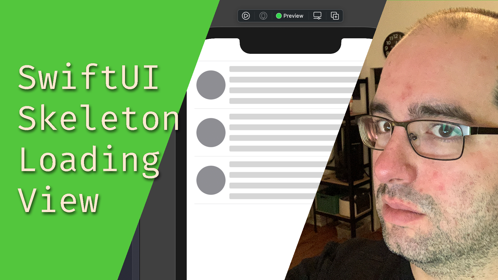

👋 Hi! I'm Matthias and I make things in iOS and in Unity.

📱 Currently making the [Backen.de](https://apps.apple.com/de/app/backen-de/id1441944766) iOS app at [Oetker Digital](https://github.com/OetkerDigital) / All About Cake.

📫 How to reach me: [@matthias_code](https://twitter.com/matthias_code), [YouTube](https://www.youtube.com/channel/UCvMdsKesM05bIG0eq7M5z1g), [LinkedIn](https://www.linkedin.com/in/matthias-zarzecki-b743353b/)

Check out my iOS-Tutorials!

