  

👋 Hi! I'm Matthias and I make things in iOS, Flutter and Unity.

📱 Freelancing. Currently at Stihl. Previously at Chrono24, Dr. Oetker, IBM iX and others.

📫 How to reach me: [@matthias_code](https://twitter.com/matthias_code), [YouTube](https://www.youtube.com/channel/UCvMdsKesM05bIG0eq7M5z1g?sub_confirmation=1), [LinkedIn](https://www.linkedin.com/in/%F0%9F%8D%8F-matthias-zarzecki-b743353b/), matthias.zarzecki [at] gmail.com.

Check out my iOS-Tutorials!
[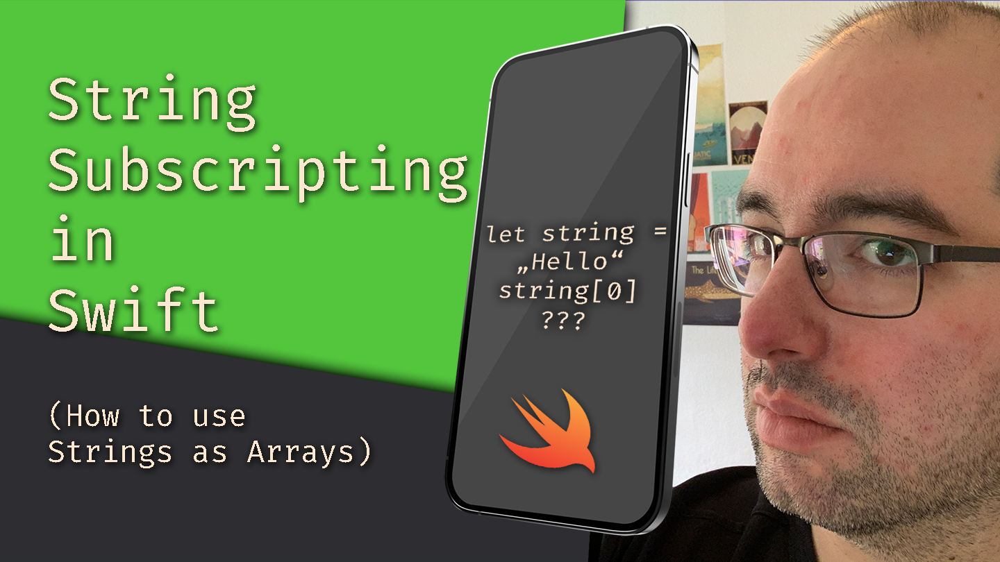](https://www.youtube.com/channel/UCvMdsKesM05bIG0eq7M5z1g?sub_confirmation=1 "The Matthias iOS Development Show Channel")

## Featured Apps
In [Standings - Basketball Widget](https://apps.apple.com/de/app/standings-basketball-widget/id1597533063?l=en) you can follow your favorite basketball team's score live on a widget on your home screen.

| _ | _ | _ |
:-------------------------:|:-------------------------:|:-------------------------:
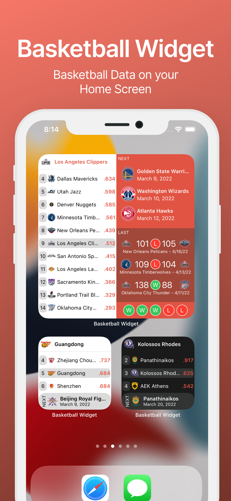|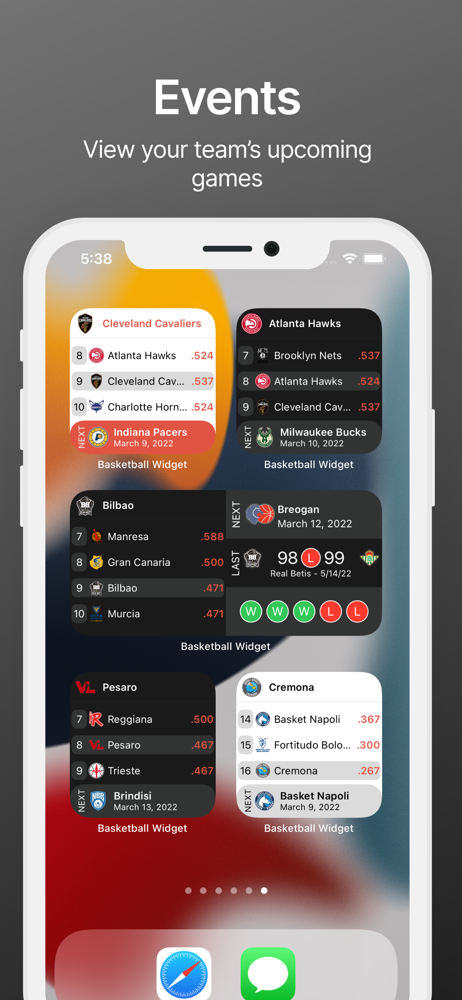|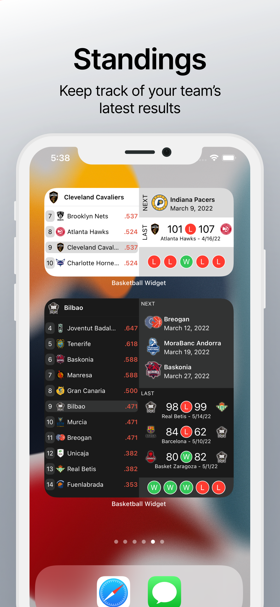

[Bluetooth Developer](https://apps.apple.com/de/app/bluetooth-developer/id6472707549?l=en-GB) allows you to scan your surroundings for nearby bluetooth devices, see what kind of devices they are, and read out data.

| _ | _ | _ |
:-------------------------:|:-------------------------:|:-------------------------:
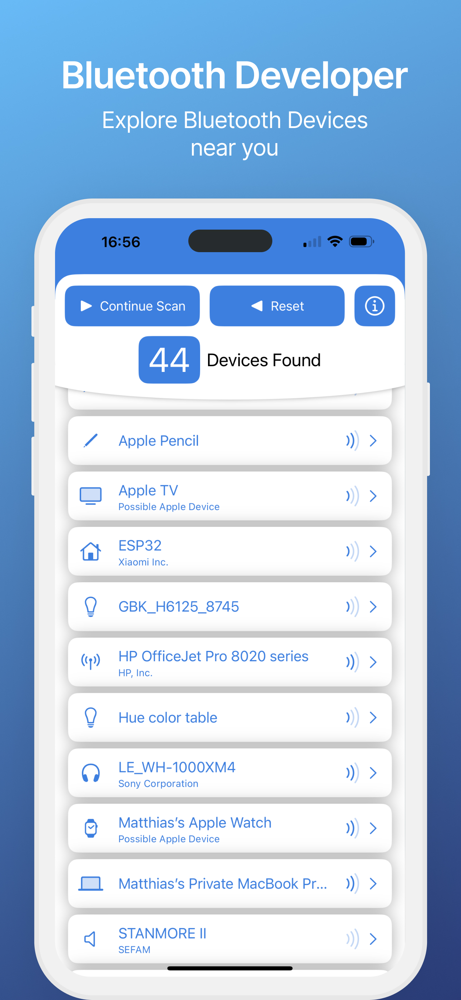|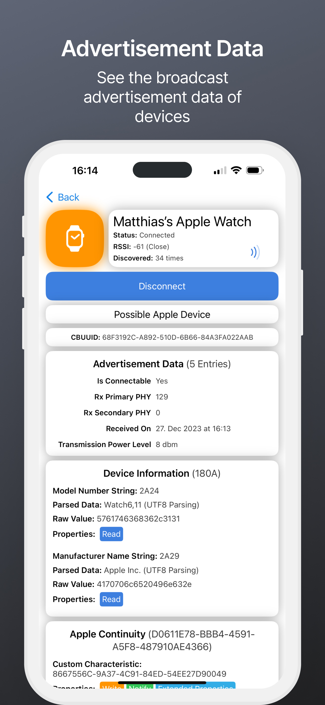|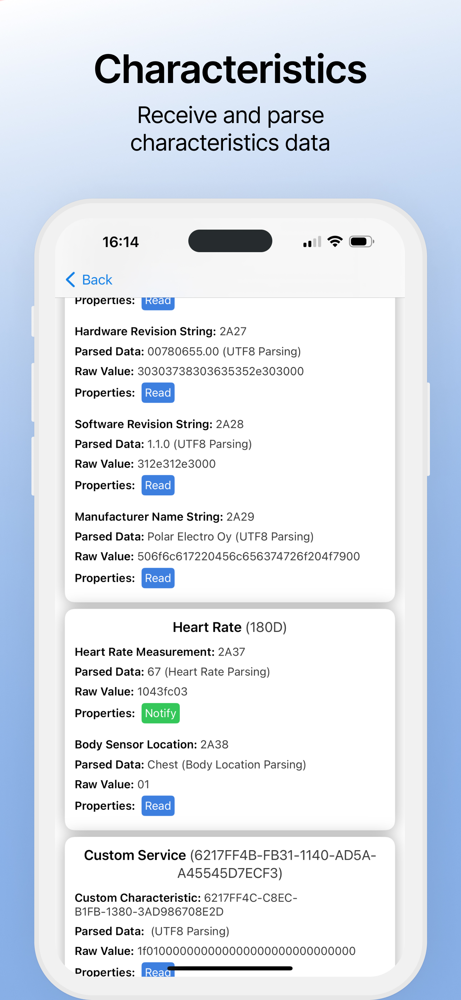

## VR / AR
I worked on various VR & AR projects, my favorite being __ShortbowVR__. Check out a video [here](https://www.youtube.com/watch?v=EDSy0RsnqVk)!
| _ | _ |
:-------------------------:|:-------------------------:
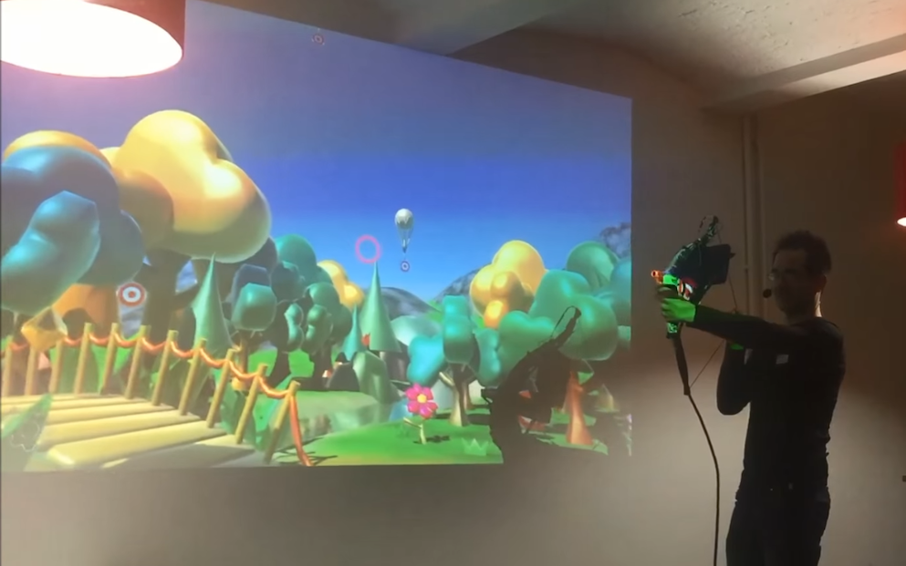|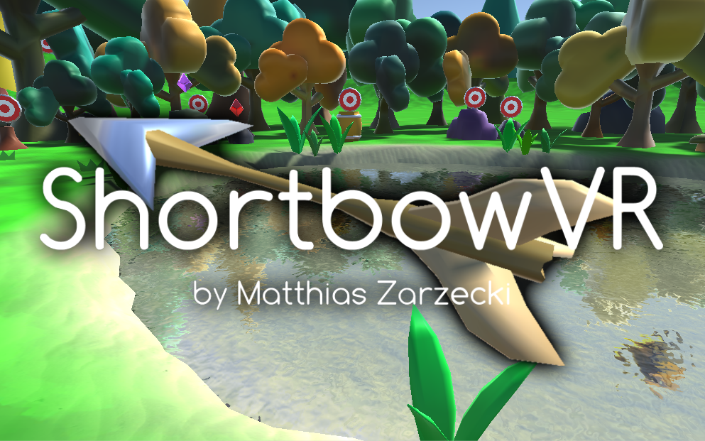

## Unity 3D
__Unstoppaball DX__ was nominated for a Unity Award 2011 and displayed at the Unite11 in San Francisco. It has 30000 downloads in the iOS App Store, and reached the 2nd place of the game charts.

| _ | _ |
:-------------------------:|:-------------------------:
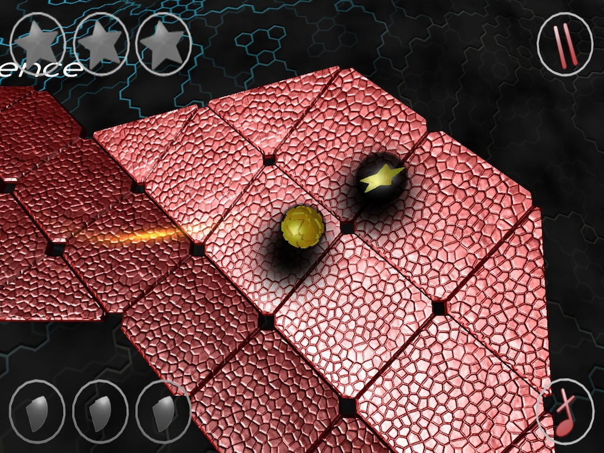|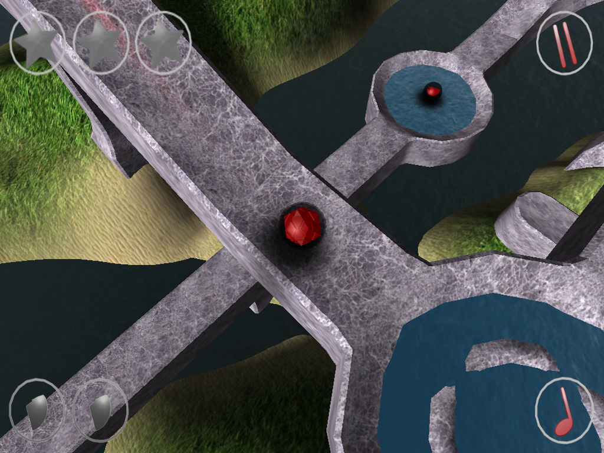

__Solar Tetris__ is a 3D Tetris game that is played from a joystick in the middle of the room. It is currently part of the Sonepar Exhibition at the Umwelt Arena near Zürich.
| _ | _ |
:-------------------------:|:-------------------------:
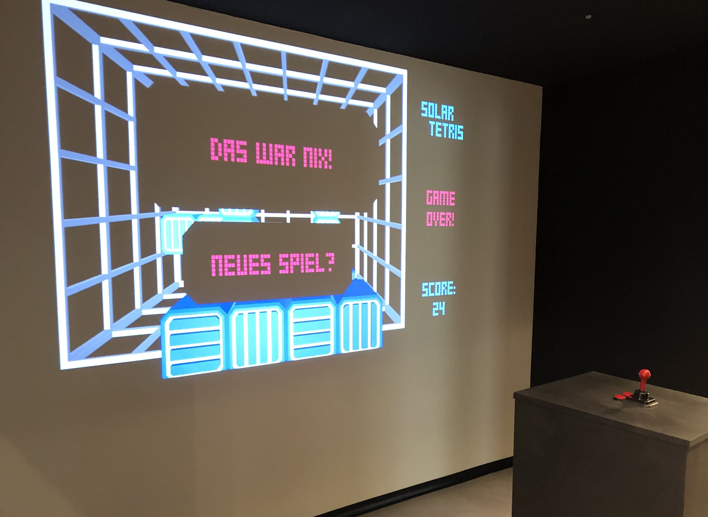|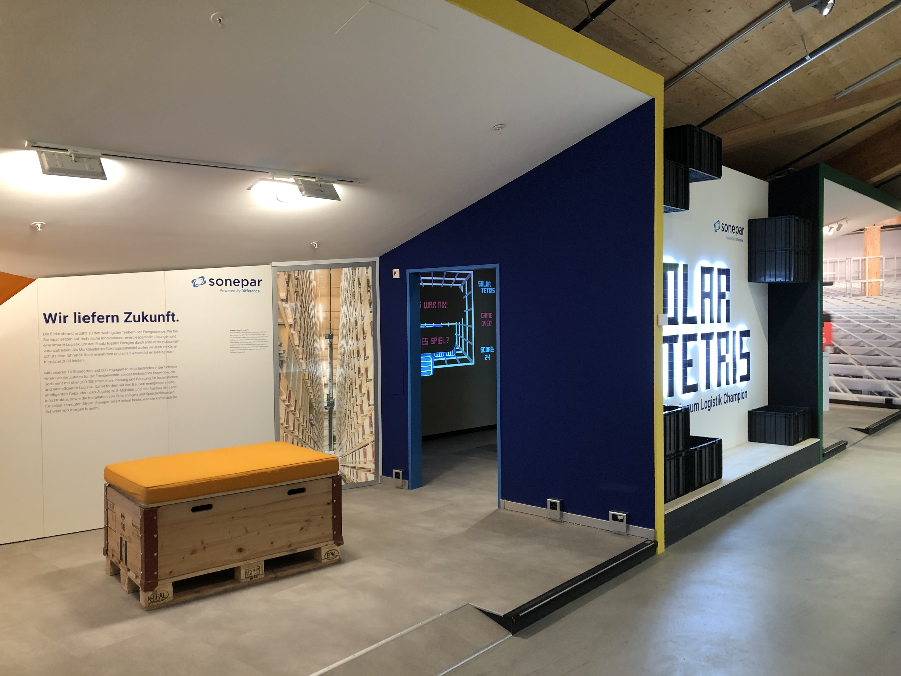

## Writing

- [How to Build a Prince-of-Persia-Style Time-Rewind System](https://gamedevelopment.tutsplus.com/how-to-build-a-prince-of-persia-style-time-rewind-system-part-1--cms-26090t) (on Tuts+)
- [How to Build Minesweeper](https://gamedevelopment.tutsplus.com/build-a-grid-based-puzzle-game-like-minesweeper-in-unity-setup--cms-21361t) (on Tuts+)
- [How to use the Video Player in Unity](https://matthewongamedesign.wordpress.com/2019/07/28/how-to-use-the-video-player-in-unity/)
